# report

<h3>Universidad Peruana de Ciencias Aplicadas</h3>

 

<strong>Ingeniería de Software - 2025-2</strong> 
<strong>1ASI0730 - Aplicaciones Web</strong> 
<strong>NRC: 7432 
<strong>Profesor: Oscar Ivan Villafuerte Bazan</strong> 

 <strong>Informe del Trabajo Final</strong>  

<strong>Startup: FijasDev</strong> 
<strong>Producto: PuntoSabor</strong> 

### Team Members:

|             Member              |   Code    |
|:-------------------------------:|:---------:|
|  Delgado Carrasco, Schneider  | u202321843 |
|  Lopez Goitia, Carlos Alberto  | u202312700 |
|  Tumi Oliden Manuel Ignacio  | u20241c134 |
|  Vega Coronado Fabricio Samir   | u202317000 |
|  Villanueva Andrade Ysaac Ligorio  | u20231c168 |

<strong> Setiembre 2025</strong> 

# Registro de Versiones del Informe

| Versión | Fecha      | Autor        | Descripción de modificación                   |
|---------|------------|--------------|-----------------------------------------------|
| 1.0     | 10/09/2025 | Fabricio Vega | Creación de la estructura inicial del reporte |
|         |            |              |                                               |
|         |            |              |                                               |
|         |            |              |                                               |
|         |            |              |                                               |
|         |            |              |                                               |

# Project Report Collaboration Insights

---

## Contenido
- [Student Outcome](#student-outcome)
- [Capítulo I: Introducción](#capítulo-i-introducción)
    - [1.1. Startup Profile](#11-startup-profile)
        - [1.1.1. Descripción de la Startup](#111-descripción-de-la-startup)
        - [1.1.2. Perfiles de integrantes del equipo](#112-perfiles-de-integrantes-del-equipo)
    - [1.2. Solution Profile](#12-solution-profile)
        - [1.2.1. Antecedentes y problemática](#121-antecedentes-y-problemática)
        - [1.2.2. Lean UX Process](#122-lean-ux-process)
            - [1.2.2.1. Lean UX Problem Statements](#1221-lean-ux-problem-statements)
            - [1.2.2.2. Lean UX Assumptions](#1222-lean-ux-assumptions)
            - [1.2.2.3. Lean UX Hypothesis Statements](#1223-lean-ux-hypothesis-statements)
            - [1.2.2.4. Lean UX Canvas](#1224-lean-ux-canvas)
    - [1.3. Segmentos objetivo](#13-segmentos-objetivo)
- [Capítulo II: Requirements Elicitation & Analysis](#capítulo-ii-requirements-elicitation--analysis)
    - [2.1. Competidores](#21-competidores)
        - [2.1.1. Análisis competitivo](#211-análisis-competitivo)
        - [2.1.2. Estrategias y tácticas frente a competidores](#212-estrategias-y-tácticas-frente-a-competidores)
    - [2.2. Entrevistas](#22-entrevistas)
        - [2.2.1. Diseño de entrevistas](#221-diseño-de-entrevistas)
        - [2.2.2. Registro de entrevistas](#222-registro-de-entrevistas)
        - [2.2.3. Análisis de entrevistas](#223-análisis-de-entrevistas)
    - [2.3. Needfinding](#23-needfinding)
        - [2.3.1. User Personas](#231-user-personas)
        - [2.3.2. User Task Matrix](#232-user-task-matrix)
        - [2.3.3. User Journey Mapping](#233-user-journey-mapping)
        - [2.3.4. Empathy Mapping](#234-empathy-mapping)
        - [2.3.5. As-is Scenario Mapping](#235-as-is-scenario-mapping)
    - [2.4. Ubiquitous Language](#24-ubiquitous-language)
- [Capítulo III: Requirements Specification](#capítulo-iii-requirements-specification)
    - [3.1. To-Be Scenario Mapping](#31-to-be-scenario-mapping)
    - [3.2. User Stories](#32-user-stories)
    - [3.3. Impact Mapping](#33-impact-mapping)
    - [3.4. Product Backlog](#34-product-backlog)
- [Capítulo IV: Product Design](#capítulo-iv-product-design)
    - [4.1. Style Guidelines](#41-style-guidelines)
        - [4.1.1. General Style Guidelines](#411-general-style-guidelines)
        - [4.1.2. Web Style Guidelines](#412-web-style-guidelines)
    - [4.2. Information Architecture](#42-information-architecture)
        - [4.2.1. Organization Systems](#421-organization-systems)
        - [4.2.2. Labeling Systems](#422-labeling-systems)
        - [4.2.3. SEO Tags and Meta Tags](#423-seo-tags-and-meta-tags)
        - [4.2.4. Searching Systems](#424-searching-systems)
        - [4.2.5. Navigation Systems](#425-navigation-systems)
    - [4.3. Landing Page UI Design](#43-landing-page-ui-design)
        - [4.3.1. Landing Page Wireframe](#431-landing-page-wireframe)
        - [4.3.2. Landing Page Mock-up](#432-landing-page-mock-up)
    - [4.4. Web Applications UX/UI Design](#44-web-applications-uxui-design)
        - [4.4.1. Web Applications Wireframes](#441-web-applications-wireframes)
        - [4.4.2. Web Applications Wireflow Diagrams](#442-web-applications-wireflow-diagrams)
        - [4.4.2. Web Applications Mock-ups](#442-web-applications-mock-ups)
        - [4.4.3. Web Applications User Flow Diagrams](#443-web-applications-user-flow-diagrams)
    - [4.5. Web Applications Prototyping](#45-web-applications-prototyping)
    - [4.6. Domain-Driven Software Architecture](#46-domain-driven-software-architecture)
        - [4.6.1. Software Architecture Context Diagram](#461-software-architecture-context-diagram)
        - [4.6.2. Software Architecture Container Diagrams](#462-software-architecture-container-diagrams)
        - [4.6.3. Software Architecture Components Diagrams](#463-software-architecture-components-diagrams)
    - [4.7. Software Object-Oriented Design](#47-software-object-oriented-design)
        - [4.7.1. Class Diagrams](#471-class-diagrams)
        - [4.7.2. Class Dictionary](#472-class-dictionary)
    - [4.8. Database Design](#48-database-design)
        - [4.8.1. Database Diagram](#481-database-diagram)
- [Capítulo V: Product Implementation, Validation & Deployment](#capítulo-v-product-implementation-validation--deployment)
    - [5.1. Software Configuration Management](#51-software-configuration-management)
        - [5.1.1. Software Development Environment Configuration](#511-software-development-environment-configuration)
        - [5.1.2. Source Code Management](#512-source-code-management)
        - [5.1.3. Source Code Style Guide & Conventions](#513-source-code-style-guide--conventions)
        - [5.1.4. Software Deployment Configuration](#514-software-deployment-configuration)
    - [5.2. Landing Page, Services & Applications Implementation](#52-landing-page-services--applications-implementation)
        - [5.2.1. Sprint 1](#521-sprint-1)
            - [5.2.1.1. Sprint Planning 1](#5211-sprint-planning-1)
            - [5.2.1.2. Aspect Leaders and Collaborators](#5212-aspect-leaders-and-collaborators)
            - [5.2.1.3. Sprint Backlog 1](#5213-sprint-backlog-1)
            - [5.2.1.4. Development Evidence for Sprint Review](#5214-development-evidence-for-sprint-review)
            - [5.2.1.5. Execution Evidence for Sprint Review](#5215-execution-evidence-for-sprint-review)
            - [5.2.1.6. Services Documentation Evidence for Sprint Review](#5216-services-documentation-evidence-for-sprint-review)
            - [5.2.1.7. Software Deployment Evidence for Sprint Review](#5217-software-deployment-evidence-for-sprint-review)
            - [5.2.1.8. Team Collaboration Insights during Sprint](#5218-team-collaboration-insights-during-sprint)

---

## Student Outcome

El curso contribuye al cumplimiento del Student Outcome ABET:

**ABET – EAC - Student Outcome 5**
**Criterio:** *Capacidad de comunicarse efectivamente con un rango de audiencias.*

En el siguiente cuadro se describe las acciones realizadas y enunciados de
conclusiones por parte del grupo, que permiten sustentar el haber alcanzado el logro
del ABET – EAC - Student Outcome 3.

| Criterio específico                                                                              | Acciones realizadas | Conclusiones |
|--------------------------------------------------------------------------------------------------|---------------------|--------------|
| Comunica oralmente con efectividad a diferentes rangos de audiencia.                                  |                     |              |
| Comunica por escrito con efectividad a diferentes rangos de audiencia |                     |              |

# Capítulo I: Introducción
## 1.1. Startup Profile
### 1.1.1. Descripción de la Startup

FijasDev es una startup orientada al desarrollo de soluciones tecnológicas innovadoras que potencian la visibilidad y el crecimiento de pequeños negocios locales, especialmente en el sector gastronómico. Su proyecto principal, PuntoSabor, es una plataforma web diseñada para conectar a los usuarios con huariques, que son establecimientos de comida tradicional y casera, poco conocidos pero con una oferta culinaria auténtica y de alta calidad.

PuntoSabor nace con el propósito de llenar un vacío existente en el mercado digital, donde los huariques suelen quedar invisibilizados ante las grandes aplicaciones de comida que priorizan restaurantes consolidados y cadenas. A través de una experiencia intuitiva y funcional, la aplicación facilita a los usuarios descubrir, valorar y recomendar estos espacios, generando una comunidad sólida y un canal de promoción eficaz para los dueños de estos negocios.

Esta iniciativa no solo busca promover la cultura gastronómica local y accesible, sino también fomentar un modelo de negocio sostenible para los pequeños emprendedores mediante la incorporación de membresías y planes publicitarios, beneficiando a todos los actores involucrados en el ecosistema.
    
### 1.1.2. Perfiles de integrantes del equipo

    

|                             Miembro                             |                                                                                                                                                                                   Descripción                                                                                                                                                                                   |
|:---------------------------------------------------------------:|:-------------------------------------------------------------------------------------------------------------------------------------------------------------------------------------------------------------------------------------------------------------------------------------------------------------------------------------------------------------------------------:|
|  |     |
|                                                                 |                                                                                                                                                                                                                                                                                                                                                                                 | 
|                                                                 |                                                                                                                                                                                                                                                                                                                                                                                 | 
|                                                                 |                                                                                                                                                                                                                                                                                                                                                                                 | 
|                                                                 |                                                                                                                                                                                                                                                                                                                                                                                 | 

## 1.2. Solution Profile

### 1.2.1. Antecedentes y problemática

#### Las 5W's y 2H's

#### What? (¿Qué?)
El problema principal es la falta de visibilidad y accesibilidad de los huariques, pequeños negocios de comida tradicional o poco conocidos, en las plataformas digitales actuales. Esto dificulta que los consumidores encuentren opciones económicas y auténticas fuera de los restaurantes populares.

#### Why? (¿Por qué?)
Las plataformas comerciales de comida priorizan grandes establecimientos por su capacidad de inversión y volumen de clientes, dejando fuera a huariques que no pueden competir en marketing digital. Esto genera un vacío donde el usuario no puede encontrar estos lugares de forma fácil y los huariques pierden oportunidades de crecimiento.

#### Where? (¿Dónde?)
Esta problemática se presenta en áreas urbanas y comunidades donde los huariques son comunes pero poco promocionados, especialmente en mercados hispanohablantes donde la cultura gastronómica local es muy rica pero poco digitalizada.

#### When? (¿Dónde?)
La falta de opciones digitales efectivas para huariques es una problemática constante, agudizada con la digitalización acelerada del mercado gastronómico en los últimos años.

#### Who? (¿Quién?)
Los afectados son dos grupos principales:

1. Los dueños de huariques, quienes luchan por atraer clientes y competir en un mercado dominado por grandes restaurantes y cadenas.

2. Los usuarios que desean descubrir comida local sabrosa, económica y auténtica pero no cuentan con un canal especializado para ello.

#### How? (¿Cómo?)
El problema se manifiesta a través de la falta de promoción digital, escasa o nula presencia en mapas y apps de comida, baja interacción con potenciales clientes y ausencia de una comunidad que recomiende estos lugares.

#### How much? (¿Cuánto?)
Este vacío representa una gran oportunidad económica desaprovechada para los dueños de huariques y una pérdida cultural gastronómica para el público. A nivel de mercado, millones de usuarios y miles de pequeños negocios quedan fuera del ecosistema digital gastronómico.

##### 1.2.2.1. Lean UX Problem Statements

- Los pequeños huariques carecen de una plataforma digital accesible y especializada para promocionar sus negocios, lo que limita su capacidad para atraer nuevos clientes y crecer.

- Los usuarios interesados en descubrir comida local auténtica y económica enfrentan dificultades para encontrar opciones fuera de las grandes apps convencionales, donde los huariques rara vez aparecen.

- La ausencia de un sistema confiable de reseñas y calificaciones enfocado en huariques dificulta la creación de confianza y comunidad entre usuarios y dueños de estos negocios.

- Las grandes aplicaciones de comida priorizan restaurantes y cadenas consolidadas, dejando una brecha para los huariques en términos de visibilidad y alcance de mercado.

- Los dueños de huariques, generalmente con recursos limitados, requieren una solución práctica y eficiente que les permita gestionar su presencia digital sin complicaciones técnicas ni costos excesivos.

##### 1.2.2.2. Lean UX Assumptions
#### Business Assumptions
- Se asume que la plataforma PuntoSabor atraerá a un número significativo de dueños de huariques interesados en aumentar su visibilidad digital mediante la membresía o planes publicitarios.

- Se espera que la implementación de un modelo de membresía o planes promocionales genere un flujo constante de ingresos recurrentes para la startup.

- Se considera que el mercado gastronómico local está dispuesto a adoptar una solución digital accesible que potencie negocios pequeños y mejore la experiencia de descubrimiento gastronómico para los usuarios.

- Se supone que una comunidad activa de usuarios y dueños de huariques facilitará el crecimiento orgánico y la retención en la plataforma.
#### User Assumptions
- Se asume que los usuarios valoran encontrar opciones de comida local auténtica, económica y poco convencional que no aparecen en apps masivas.

- Se espera que los usuarios utilicen la app no solo para descubrir huariques, sino también para calificar y dejar reseñas que ayuden a otros usuarios.

- Se considera que la facilidad de uso, el acceso a fotos, especialidades, rango de precios y mapas integrados incentivarán la utilización frecuente de la plataforma por parte de los usuarios.

- Se supone que la posibilidad de guardar favoritos y consultar rankings motivará a los usuarios a regresar y recomendar PuntoSabor dentro de su comunidad.

- Se asume que los dueños o administradores de huariques encontrarán sencillo y valioso el proceso de registrar y gestionar su negocio en la app para aumentar su visibilidad y atraer clientes.

- Se espera que estos usuarios aporten información completa y actualizada de sus huariques, incluyendo fotos, especialidades y precios, para mejorar la experiencia de los visitantes.

- Se considera que incentivos como la membresía y la interacción con la comunidad fomentarán un compromiso activo por parte de los dueños para mantener su presencia digital actualizada y atractiva.

##### 1.2.2.3. Lean UX Hypothesis Statements

- Creemos que ofrecer una plataforma fácil e intuitiva para descubrir huariques auténticos y económicos aumentará la cantidad de usuarios que visitan estos negocios. Sabremos que esto es cierto cuando al menos el 60% de los usuarios activos reporten haber visitado un huarique recomendado en la plataforma durante el primer mes de uso.

- Creemos que permitir a los dueños de huariques registrar y gestionar su negocio con fotos, especialidades y precios incentivará su participación activa y mejorará la calidad del contenido disponible. Sabremos que esto es cierto cuando al menos el 50% de los huariques registrados actualicen su información o respondan a reseñas dentro de los primeros tres meses tras su registro.

- Creemos que la integración de mapas y funciones de geolocalización facilitará a los usuarios encontrar huariques cercanos, aumentando la interacción y el uso recurrente de la app. Sabremos que esto es cierto cuando al menos el 70% de las búsquedas y accesos diarios incluyan el uso del mapa durante el primer mes de lanzamiento.

- Creemos que un sistema confiable de reseñas y calificaciones incentivará la confianza en los usuarios y motivará a más personas a utilizar PuntoSabor como su app de referencia para descubrir huariques. Sabremos que esto es cierto cuando el 80% de los huariques tengan al menos cinco reseñas activas y una valoración promedio superior a 4 estrellas en los primeros tres meses.

- Creemos que la oferta de planes de membresía y publicidad atraerá a suficientes dueños de huariques para generar ingresos recurrentes sostenibles. Sabremos que esto es cierto cuando el 30% de los huariques registrados contraten al menos un plan pago durante los primeros seis meses.

##### 1.2.2.4. Lean UX Canvas

## 1.3. Segmentos objetivo
##Exploradores Gastronómicos

- Edad: 18 a 40 años.

- Estilo de vida: Activos, curiosos, buscan descubrir comida auténtica y económica.

- Uso de tecnología: Frecuente, usuarios habituales de apps móviles y web para buscar lugares para comer.

- Necesidad principal: Encontrar huariques poco conocidos con buena sazón y precios accesibles.

- Beneficios buscados: Acceso a recomendaciones confiables, mapas con ubicación cercana, y sistema de reseñas para tomar decisiones informadas.

##Dueños y Administradores de Huariques

- Perfil: Emprendedores y pequeños negocios de comida tradicional o casera.

- Necesidad principal: Promocionar su negocio, aumentar la visibilidad y atraer nuevos clientes de manera sencilla, accesible y rentable.

- Beneficios buscados: Herramienta accesible para gestionar su información en la plataforma, recibir retroalimentación valiosa y utilizar planes de membresía o publicidad para crecer.

# Capítulo II: Requirements Elicitation & Analysis
## 2.1. Competidores
### 2.1.1. Análisis competitivo

En el mercado actual existen varias aplicaciones y plataformas de comida que permiten a los usuarios buscar restaurantes y lugares para comer, como Uber Eats, Rappi, Google Maps y Yelp. Sin embargo, estas apps dan prioridad a restaurantes establecidos y cadenas, dejando poco espacio para huariques o negocios gastronómicos locales y poco conocidos.

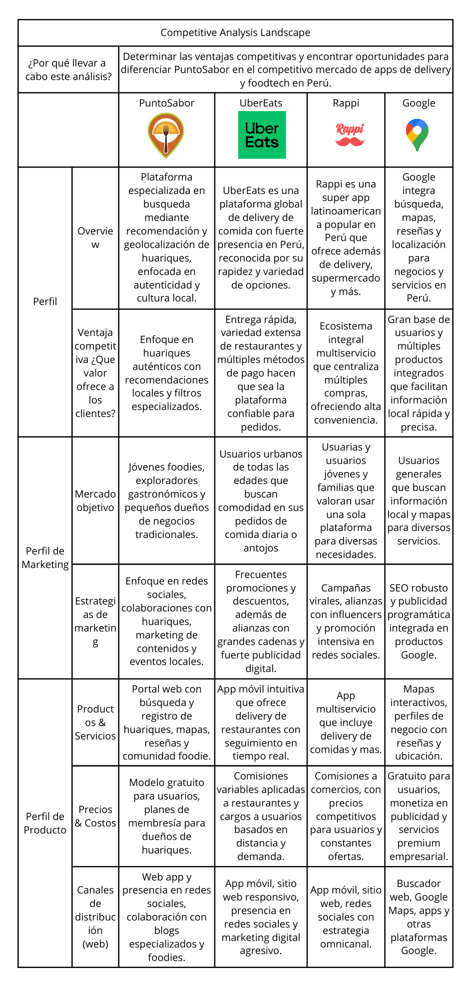
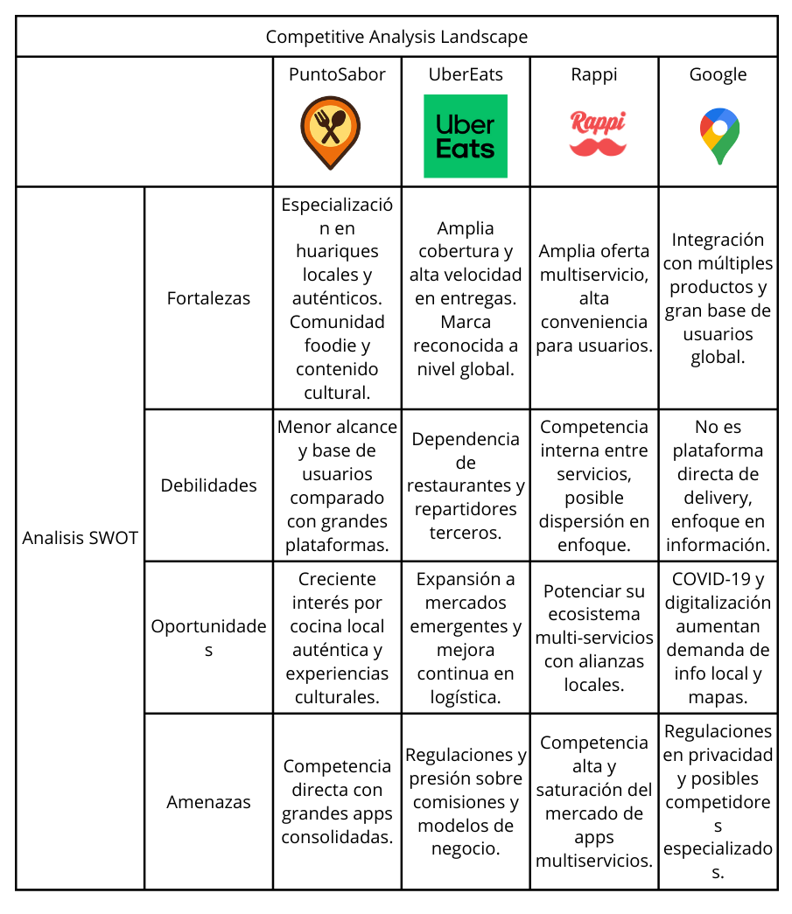

PuntoSabor se diferencia al enfocarse exclusivamente en huariques, ofreciendo un espacio especializado para pequeños negocios de comida tradicional que generalmente no aparecen destacados en otras plataformas. Además, cuenta con funcionalidades específicas como la gestión directa de huariques por parte de sus dueños, un sistema de reseñas y calificaciones centrado en estos locales, y un modelo de membresía para impulsar la visibilidad.

### 2.1.2. Estrategias y tácticas frente a competidores.  

Para diferenciar a PuntoSabor de las grandes plataformas generales y posicionarse con éxito en el nicho de huariques, se plantean las siguientes estrategias y tácticas:

Estrategias:
- Enfocar la plataforma exclusivamente en pequeños negocios de comida local poco conocidos, lo que permitirá ofrecer una experiencia única y auténtica que los competidores masivos no cubren adecuadamente.

- Fomentar la participación activa de usuarios y dueños mediante reseñas, recomendaciones y la creación de contenido auténtico, generando un sentido de pertenencia y confianza.

- Desarrollar un esquema de ingresos basado en membresías y publicidad accesible para dueños de huariques, equilibrando la monetización con el crecimiento orgánico de la plataforma.

Tácticas: 

- Utilizar publicidad en redes sociales y buscadores orientada a zonas urbanas específicas donde se ubican huariques, para captar tanto usuarios como dueños interesados.

- Colaborar con organizaciones, ferias y eventos de comida para promover la app y sumar huariques relevantes a la plataforma.

- Garantizar que la app web sea fácil de usar, rápida y accesible, incluyendo funciones de mapa intuitivas, sistema sencillo para agregar y actualizar huariques, y una interfaz de usuario amigable.

- Crear incentivos como descuentos, reconocimientos o beneficios por participación activa (reseñas, actualización de perfil, membresía) para motivar el uso y la fidelización.

- Implementar un sistema de análisis y respuesta rápida a sugerencias y problemas reportados por los usuarios para mejorar continuamente la plataforma.

## 2.2. Entrevistas
### 2.2.1. Diseño de entrevistas

Segmento 1: Exploradores Gastronómicos (Usuarios de la app web)

Objetivo: Entender sus motivaciones, comportamientos y expectativas al usar una app web para descubrir comida local auténtica.

Preguntas Segmento 1:
- ¿Con qué frecuencia usas aplicaciones web para buscar lugares para comer fuera de lo común?
- ¿Cómo sueles descubrir huariques o lugares de comida poco conocidos en la web?
- ¿Qué aspectos valoras más al elegir un lugar para comer usando una app web (precio, ubicación, reseñas, fotos, etc.)?
- ¿Qué dificultades has tenido al usar apps web para buscar lugares de comida local?
- ¿Qué te motivaría a usar una app web dedicada exclusivamente a huariques?
- ¿Qué funcionalidades en la app web considerarías imprescindibles para usarla con regularidad?
- ¿Qué preocupaciones o barreras tendrías al usar una app web para descubrir huariques?

Segmento 2: Dueños y Administradores de Huariques (Usuarios que usan la app web para gestionar su huarique).

Objetivo: Comprender sus necesidades y expectativas al usar la app web para administrar y promocionar sus huariques.

Preguntas Segmento 2:
- ¿Actualmente usas alguna plataforma web o digital para promocionar tu huarique? ¿Cuál?
- ¿Qué retos has enfrentado al tratar de gestionar tu negocio a través de plataformas digitales?
- ¿Qué tan cómodo te sientes usando aplicaciones web para actualizar la información de tu negocio?
- ¿Qué características te harían decidirte a usar una app web especializada para huariques?
- ¿Qué tipo de soporte o facilidades esperarías al usar esta app web para gestionar tu perfil o negocio?
- ¿Qué modelo de tarifas o membresías considerarías justo para usar esta plataforma?
- ¿Qué resultados te gustaría ver después de usar esta aplicación web para promocionar tu huarique?

### 2.2.2. Registro de entrevistas
### Segmento #1: Exploradores Gastronómicos (Usuarios de la app web)
| Número de entrevista | Datos del entrevistado                                                                 | Evidencia de entrevista |
|-----------------------|-----------------------------------------------------------------------------------------|--------------------------|
| 1                     | **Nombre:**  Vitaly Baca    **Edad:** 20    **Distrito:** Lurin    **Resumen:** Vitaly Baca, estudiante de 20 años de Ingeniería de Software en la UPC, utiliza este tipo de aplicaciones casi todos los fines de semana, pues disfruta salir con su pareja o amigos a probar lugares nuevos. Descubre la mayoría de huariques en TikTok e Instagram siguiendo a foodies, y también explora en Google Maps. Lo primero que valora es el precio, ya que como estudiante tiene un presupuesto ajustado, seguido de fotos y comentarios confiables para no caer en un mal sitio. Entre las dificultades que ha enfrentado menciona que a veces llega a lugares que aparecen como abiertos pero están cerrados, además de que muchos huariques pequeños ni siquiera figuran en las apps. Se sentiría motivado a usar una app exclusiva de huariques siempre que tenga reseñas sinceras de usuarios similares a él. Considera imprescindibles los filtros por precio y tipo de comida, un mapa rápido e intuitivo y recomendaciones personalizadas. Sus principales preocupaciones serían que la app se llene de publicidad, tenga información poco confiable o incluya muy pocos lugares en su ciudad, perdiendo su valor. |    [📂 Ver entrevista](https://drive.google.com/file/d/1NSQkOkLNAq3A-IIhc4_lm2q3UwWDaylk/view?usp=sharing) 00:00 - 05:37|

| Número de entrevista | Datos del entrevistado                                                                 | Evidencia de entrevista |
|-----------------------|-----------------------------------------------------------------------------------------|--------------------------|
| 2                     | **Nombre:** Sebastian del Rio    **Edad:** 20    **Distrito:** Chorrillos    **Resumen:** Sebastián del Río, estudiante de 20 años de Ingeniería de Software en la UTP, no suele usar aplicaciones web con mucha frecuencia para buscar huariques, apenas una o dos veces al mes cuando quiere salir con amigos o probar algo distinto. Descubre la mayoría de lugares por recomendaciones en TikTok e Instagram, y ocasionalmente en Google Maps. Para él, lo más importante al elegir un lugar son las fotos y reseñas reales de otros usuarios, además del precio y la cercanía. Señala como principal dificultad que los huariques casi no aparecen en las aplicaciones, predominando los restaurantes conocidos, además de que muchas veces la información está incompleta o sin buenas fotos. Lo motivaría a usar una app que realmente muestre sitios auténticos y confiables, siempre que sea sencilla. Considera imprescindibles fotos reales, reseñas honestas, mapa con ubicación, filtros de precio y la opción de guardar favoritos. Su mayor preocupación sería que la información no sea confiable, que la app lo mande a lugares cerrados o de baja calidad, o que sea complicada y lenta. |    [📂 Ver entrevista](https://drive.google.com/file/d/1NSQkOkLNAq3A-IIhc4_lm2q3UwWDaylk/view?usp=sharing) 05:37 - 09:56|

| Número de entrevista | Datos del entrevistado                                                                 | Evidencia de entrevista |
|-----------------------|-----------------------------------------------------------------------------------------|--------------------------|
| 3                     | **Nombre:** Luis Fernandez    **Edad:** 20    **Distrito:** Pueblo Libre    **Resumen:** Luis Fernández, estudiante de 20 años de Ingeniería de Sistemas en la UTP, busca lugares nuevos casi todas las semanas, sobre todo los fines de semana cuando sale con su pareja. Se guía por cuentas de foodies en Instagram y TikTok, guarda videos para después y también consulta reseñas en Google Maps o en grupos de Facebook. Para él, el precio es fundamental, pero también valora la experiencia completa: reseñas sobre la atención y la calidad de la comida, junto con fotos de los platos. Ha tenido problemas con horarios desactualizados en apps, llegando a lugares cerrados, y con la falta de visibilidad de huariques menos conocidos. Lo motivaría una app confiable que se enfoque en huariques y cuente con reseñas de personas locales. Considera imprescindibles los filtros por tipo de comida, precio y ubicación, un mapa interactivo y recomendaciones personalizadas. Sus preocupaciones son que la aplicación tenga publicidad excesiva, información falsa o que no incluya suficientes opciones locales. |    [📂 Ver entrevista](https://drive.google.com/file/d/1NSQkOkLNAq3A-IIhc4_lm2q3UwWDaylk/view?usp=sharing) 09:56 - 13:01|

### 2.2.3. Análisis de entrevistas
### Segmento #1: Exploradores Gastronómicos (Usuarios de la app web)
---
### Hallazgos :
## 👨 Vitaly Baca

Utiliza aplicaciones web casi todos los fines de semana, ya que le gusta salir con amigos o su pareja a probar lugares nuevos. Descubre la mayoría de huariques en TikTok e Instagram siguiendo a foodies, además de explorar en Google Maps. Da mucha importancia al precio por su condición de estudiante, pero también a fotos y comentarios confiables. Ha tenido problemas con locales que aparecen como abiertos y en realidad estaban cerrados, además de que muchos huariques pequeños no figuran en las apps. Se motivaría a usar una aplicación centrada exclusivamente en huariques, siempre que tenga reseñas sinceras de usuarios similares. Considera indispensables los filtros por precio y tipo de comida, un mapa rápido e intuitivo y recomendaciones personalizadas. Sus preocupaciones son que la app se llene de publicidad, tenga información poco confiable o muy pocos sitios en su ciudad.

**Puntos clave:**
- Usa apps de búsqueda gastronómica con frecuencia (fines de semana).  
- Descubre lugares principalmente en **TikTok, Instagram y Google Maps**.  
- Valora sobre todo el **precio**, seguido de **fotos y reseñas confiables**.  
- Ha tenido problemas con **información desactualizada** y huariques que no aparecen.  
- Se motiva por una app exclusiva con reseñas sinceras.  
- Considera imprescindibles **filtros, mapa interactivo y recomendaciones personalizadas**.  
- Le preocupa la **publicidad excesiva** y la **poca cobertura local**.  

## 👨 Sebastián del Río

No suele usar con mucha frecuencia aplicaciones para buscar huariques, apenas una o dos veces al mes cuando quiere salir con amigos o hacer algo distinto. Descubre los lugares principalmente en TikTok e Instagram, y ocasionalmente en Google Maps. A la hora de elegir un sitio, valora sobre todo fotos y reseñas reales, además del precio y la cercanía. Ha tenido como dificultad que los huariques casi no aparecen en las apps, predominan restaurantes conocidos y la información muchas veces es incompleta o sin buenas fotos. Se sentiría motivado a usar una app que realmente muestre sitios auténticos y confiables, siempre que sea sencilla. Para él son imprescindibles fotos reales, reseñas honestas, un mapa interactivo con ubicación, filtros de precio y la opción de guardar favoritos. Sus preocupaciones son que la información no sea confiable, que lo mande a lugares cerrados o de mala calidad, y que la app sea complicada o lenta.

**Puntos clave:**
- Usa apps **esporádicamente** (1–2 veces al mes).  
- Descubre huariques en **redes sociales** y a veces en Google Maps.  
- Valora **fotos, reseñas reales, precio y cercanía**.  
- Problemas: **huariques invisibles, info incompleta y fotos deficientes**.  
- Se motiva por una app **auténtica y confiable**.  
- Imprescindibles: **fotos reales, reseñas honestas, mapa interactivo, filtros y favoritos**.  
- Preocupaciones: **información falsa, lugares cerrados, app lenta o complicada**.  

## 👨 Luis Fernández

Busca lugares nuevos casi todas las semanas, sobre todo los fines de semana con su pareja. Se guía por cuentas de foodies en Instagram y TikTok, guarda videos para consultarlos luego y revisa reseñas en Google Maps y grupos de Facebook. Da gran importancia al precio, pero también a la experiencia completa: reseñas sobre la atención, calidad de la comida y fotos de los platos. Entre las dificultades menciona horarios desactualizados en apps, que lo llevan a locales cerrados, y la poca visibilidad de huariques menos conocidos. Se motivaría a usar una app confiable que priorice huariques con reseñas de personas locales. Considera imprescindibles los filtros por tipo de comida, precio y ubicación, un mapa interactivo y recomendaciones personalizadas. Sus preocupaciones son que la app tenga publicidad excesiva, información falsa o que no incluya suficientes opciones locales.

**Puntos clave:**
- Usa apps **frecuentemente**, casi cada semana.  
- Descubre lugares en **TikTok, Instagram, Google Maps y Facebook**.  
- Valora **precio, experiencia completa, fotos y reseñas sobre atención/comida**.  
- Problemas: **horarios desactualizados, falta de visibilidad de huariques pequeños**.  
- Se motiva por una app **confiable y enfocada en huariques**.  
- Imprescindibles: **filtros por comida, precios y ubicación, mapa interactivo, recomendaciones**.  
- Preocupaciones: **publicidad excesiva, información falsa, pocas opciones locales**.
## Segmento #2: Dueños y Administradores de Huariques

## 2.3. Needfinding
### 2.3.1. User Personas
Para comprender mejor las necesidades, motivaciones y comportamientos de los usuarios clave de PuntoSabor, se han desarrollado dos perfiles de usuario o personas representativas. Estos perfiles sintetizan características típicas, objetivos y retos de los segmentos principales, facilitando el diseño centrado en el usuario y la toma de decisiones estratégicas durante el desarrollo de la plataforma.

- Persona  1: Carla, la Exploradora Gastronómica

    Carla representa a los usuarios jóvenes y activos, interesados en descubrir opciones gastronómicas  auténticas y económicas que escapan de las ofertas convencionales. Este perfil valora la facilidad para encontrar huariques confiables a través de plataformas digitales que les brinden información clara, reseñas verídicas y una experiencia de navegación sencilla.
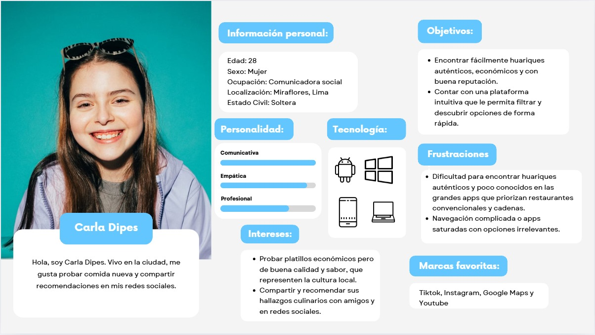

- Persona 2: Don Luis, dueño de huarique tradicional

    Don Luis encarna a los pequeños emprendedores y dueños de huariques que necesitan herramientas accesibles y prácticas para promocionar su negocio y aumentar su clientela. Con experiencia limitada en tecnología digital, busca soluciones fáciles de usar que le permitan gestionar su presencia online sin mayores complicaciones ni costos elevados.
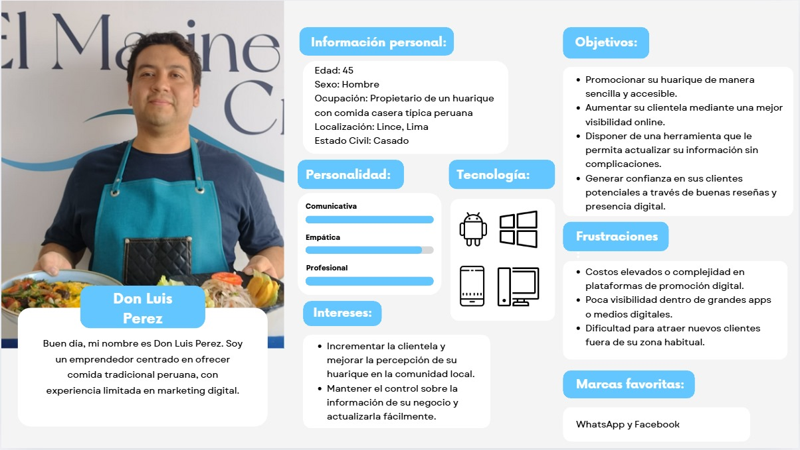

### 2.3.2. User Task Matrix

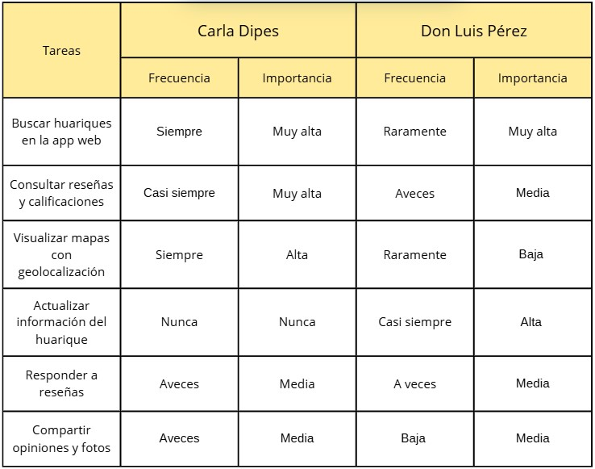

Las tareas más frecuentes para los perfiles de usuario en PuntoSabor muestran diferencias claras según el rol y necesidades de cada uno. Carla Dípes, como exploradora gastronómica, utiliza la app web de forma activa y constante para buscar huariques, consultar reseñas y utilizar la función de mapas con geolocalización, considerándolas cruciales para su experiencia. En contraste, Don Luis Pérez, dueño de huarique, rara vez usa la app para buscar o visualizar mapas, enfocándose principalmente en actualizar la información de su huarique, actividad que realiza con regularidad y considera muy importante. Ambas personas interactúan ocasionalmente con la funcionalidad de responder reseñas y compartir opiniones o fotos, aunque para Don Luis, la frecuencia de estas últimas es menor pero sigue siendo relevante en términos de importancia.

Coincidencias:
- Ambos interactúan ocasionalmente con la función de responder reseñas, considerándola de importancia media.

- Comparten una actitud media hacia la importancia de compartir opiniones y fotos, aunque la frecuencia es mayor en Carla.

- Las funciones relacionadas con interacción social y comunidad tienen importancia media para ambos perfiles.

Diferencias:
- Carla es una usuaria frecuente de la búsqueda y consulta de huariques y mapas, mientras que Don Luis tiene menor frecuencia en estas tareas porque su rol es más de gestión.

- Don Luis dedica más tiempo y considera importante la actualización de la información de su huarique, una tarea que Carla no realiza.

- El nivel de interacción con mapas y geolocalización es alto para Carla y bajo para Don Luis debido a sus diferentes objetivos y roles en la plataforma.

### 2.3.3. User Journey Mapping
Segmento 1

Mediante este artefacto se explicará y comprenderá cómo los usuarios del segmento 1 (Exploradores Gastronómicos) realizan sus actividades para alcanzar sus objetivos desde su perspectiva. Este segmento representa a personas que buscan experiencias culinarias auténticas y económicas, explorando huariques poco conocidos y valorando la información confiable proporcionada por reseñas, fotos y mapas de ubicación.

Segmento 2

Mediante este artefacto se explicará y comprenderá cómo los usuarios del segmento 2 (Dueños y Administradores de Huariques) realizan sus actividades para alcanzar sus objetivos desde su perspectiva. Este segmento agrupa a pequeños emprendedores que desean promocionar su negocio, mejorar su visibilidad y atraer nuevos clientes mediante una plataforma accesible y sencilla de gestionar, sin necesidad de tener conocimientos técnicos avanzados.

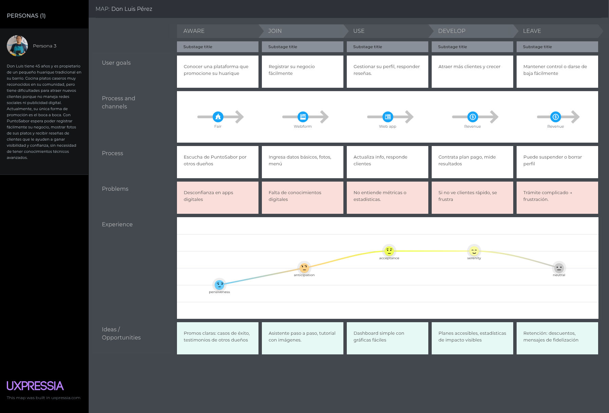

### 2.3.4. Empathy Mapping
A continuación se presentan los mapas de empatía para los dos perfiles principales de usuarios de PuntoSabor: Carla Dípes, la exploradora gastronómica, y Don Luis Pérez, dueño de huarique tradicional. Estos mapas permiten comprender en profundidad sus necesidades, pensamientos, sentimientos y comportamientos, facilitando un diseño centrado en el usuario.

- Segmento 1:

El mapa de empatía de Carla muestra que es una usuaria que busca autenticidad y experiencias gastronómicas locales únicas. Valora la facilidad para encontrar información confiable y se siente frustrada por la saturación de opciones genéricas en otras plataformas.

- Segmento 2:

El mapa de empatía de Don Luis refleja un emprendedor con limitaciones tecnológicas, que necesita una herramienta sencilla para gestionar su huarique y aumentar su clientela. Busca soporte y soluciones accesibles que faciliten su presencia digital sin costos elevados.
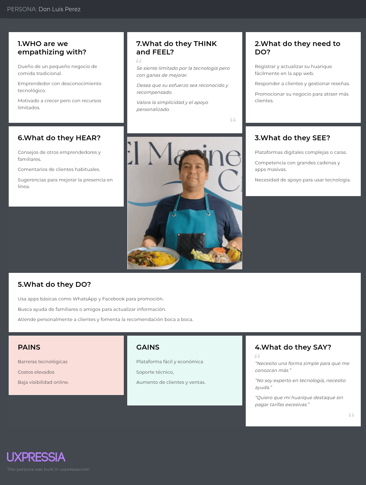

### 2.3.5. As-is Scenario Mapping
Segmento 1

Mediante este artefacto, se ha llevado a cabo la elaboración del As-is Scenario Mapping para el primer segmento (Exploradores Gastronómicos). Este escenario refleja cómo los usuarios interesados en descubrir huariques realizan actualmente sus actividades, las dificultades que enfrentan al buscar opciones auténticas y económicas, así como las percepciones y emociones que experimentan en cada etapa de su recorrido.

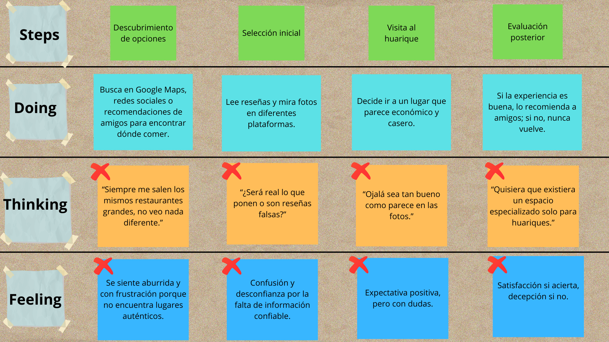

Segmento 2

Mediante este artefacto, se ha llevado a cabo la elaboración del As-is Scenario Mapping para el segundo segmento (Dueños y Administradores de Huariques). Este escenario describe cómo los pequeños emprendedores gestionan hoy en día la promoción y organización de sus negocios, evidenciando los procesos manuales, las limitaciones tecnológicas y las emociones vinculadas a su necesidad de obtener mayor visibilidad y atraer nuevos clientes.

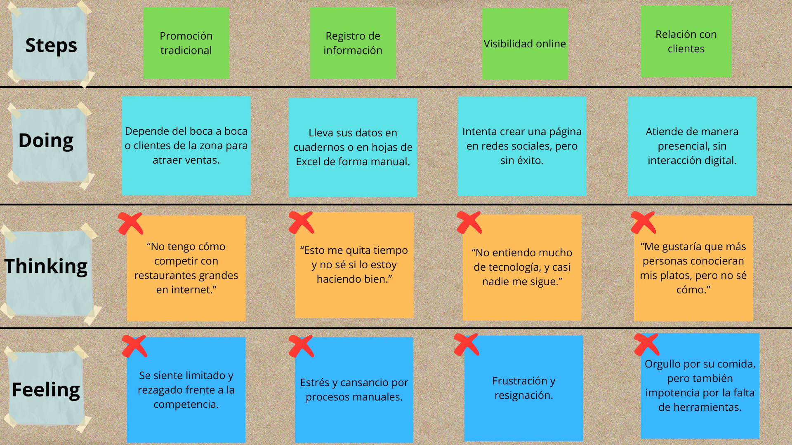

## 2.4. Ubiquitous Language

En esta sección se crea un glosario con los términos esenciales del dominio del negocio PuntoSabor, siguiendo el enfoque de Ubiquitous Language en Domain Driven Design. Este glosario ofrece definiciones precisas y claras de los conceptos relevantes al problema y su solución, promoviendo una comunicación eficiente entre todos los integrantes del equipo.

- Huarique: Pequeño restaurante tradicional peruano, generalmente conocido por su comida casera y local, que es el principal tipo de establecimiento que la app PuntoSabor busca promover.

- Explorador Gastronómico: Usuario de la app PuntoSabor que busca descubrir huariques auténticos, económicos y poco conocidos mediante la plataforma web.

- Dueño y/o administrador de Huarique: Persona responsable de un huarique que utiliza la app para registrar, actualizar y promocionar su negocio ante potenciales clientes.

- Reseña: Opinión o evaluación que un usuario deja en la app acerca de su experiencia en un huarique, incluyendo comentarios y calificaciones.

- Mapa de Geolocalización: Funcionalidad de la app que muestra la ubicación exacta de los huariques en un mapa interactivo para facilitar su localización.

- Favorito: Huarique guardado por un usuario en la app para futuras visitas o recomendaciones.

- Gestión del Huarique: Conjunto de acciones realizadas por el dueño para mantener actualizada la información, responder reseñas y promover su negocio dentro de la aplicación.

- Membresía: Plan o suscripción que puede contratar un dueño de huarique para acceder a servicios adicionales de promoción dentro de la app.

- Interacción Comunitaria: Comunicación entre usuarios y dueños a través de reseñas, comentarios y respuestas que enriquecen la experiencia y confianza en la plataforma.

- Este lenguaje común asegura que desarrolladores, diseñadores y stakeholders utilicen terminología única y coherente en toda la documentación, código y comunicación, orientando el desarrollo hacia la resolución efectiva de las necesidades del negocio.

# Capítulo III: Requirements Specification
## 3.1. To-Be Scenario Mapping
### Segmento 1 
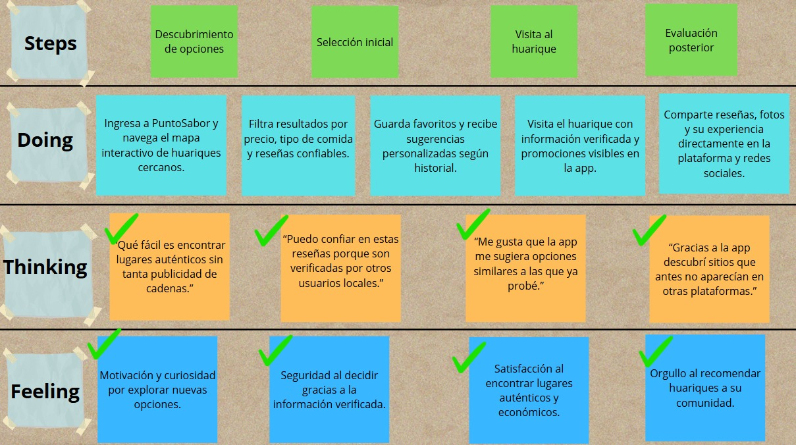
### Segmento 2
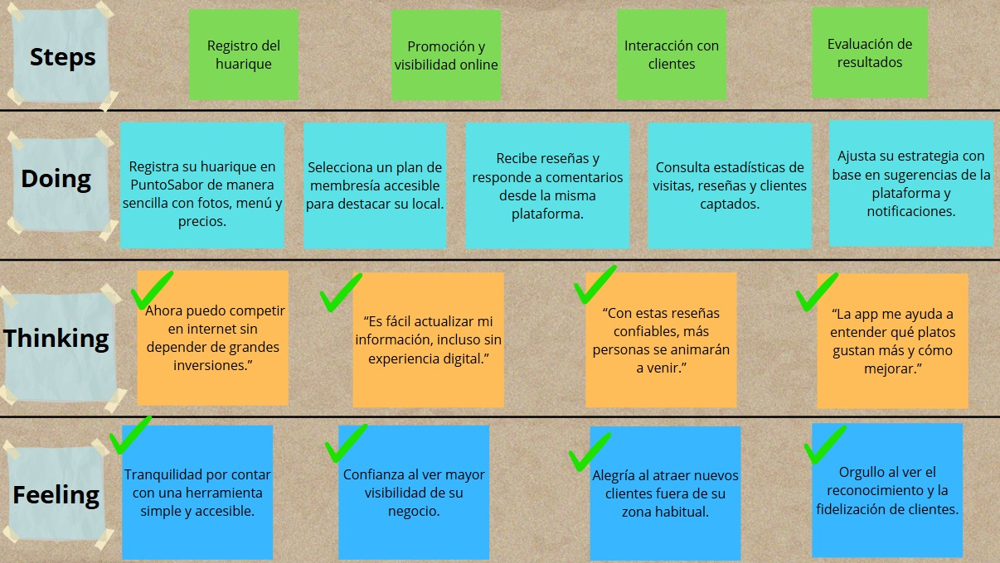
## 3.2. User Stories
En esta sección se presentan los requisitos definidos para PuntoSabor, expresados mediante User Stories y Epics. Cada User Story incluye criterios de aceptación claros y comprobables, redactados en tiempo presente y tercera persona, siguiendo la estructura Gherkin (Given-When-Then). Se considera tanto la experiencia del usuario en la app web como aspectos técnicos del desarrollo, incluyendo historias técnicas para el RESTful API.

A continuación, se muestra un cuadro resumen con los Epics y User Stories definidos, sus descripciones, criterios de aceptación y relaciones entre ellos.
 
| Epic / Story ID | Título | Descripción | Criterios de Aceptación | Relacionado con (Epic ID) |
|-----------------|--------|-------------|-------------------------|---------------------------|
| EP01 | Descubrimiento de Huariques | Como explorador gastronómico, quiero buscar y descubrir huariques locales para elegir dónde comer. |  |  |
| EP02 | Gestión de Huariques | Como dueño, quiero registrar y actualizar la información de mi huarique para mantenerlo visible. |             |                           |
| EP03 | Interacción Comunitaria | Como usuario, quiero dejar reseñas y calificaciones para compartir mi opinión. |        |                           |
| EP04 | Información del Sitio Web Estático | Como visitante, quiero acceder a una landing page con información clara sobre PuntoSabor y sus servicios. |     |                           |
| EP05 | Notificaciones y Alertas | Como usuario, quiero recibir notificaciones sobre novedades, promociones o actualizaciones. |                |                           |
| EP06 | Servicios Técnicos y API | Como developer, necesito APIs RESTful para gestionar huariques, usuarios y búsquedas. |           |                           |
| EP07 | Seguridad y Autenticación | Como usuario, quiero que mis datos estén protegidos y acceder con autenticación segura. |              |                           |
| EP08 | Personalización y Recomendador | Como usuario, quiero recibir sugerencias ajustadas a mis preferencias y búsquedas previas, para descubrir huariques relevantes a mis gustos y presupuesto. |
| EP09 | Calidad de Datos y Verificación | Como usuario, quiero que la plataforma valide horarios, estado abierto/cerrado y datos clave de los huariques para no perder tiempo en información desactualizada. |
| EP10 | Monetización y Facturación | Como dueño de huarique, quiero acceder a planes de membresía claros y a facturación transparente para mejorar la visibilidad de mi negocio. |
| US01 | Búsqueda avanzada | Como usuario, puedo filtrar huariques por ubicación, tipo de comida y precio para una búsqueda eficiente. | Escenario 1: Filtrado con resultados. Dado que el usuario aplica filtros válidos, Cuando realiza la búsqueda, Entonces la app muestra huariques que cumplen esos filtros. Escenario 2: Filtrado sin resultados Dado que el usuario aplica filtros estrictos sin coincidencias, Cuando realiza la búsqueda, Entonces aparece un mensaje de "No se encontraron huariques con esos filtros". Escenario 3: Búsqueda sin filtros Dado que el usuario no aplica filtros, Cuando realiza la búsqueda, Entonces la app muestra todos los huariques disponibles. | EP01 |
| US02 | Visualización en mapa | Como usuario, quiero ver la ubicación de los huariques en un mapa para facilitar la visita. | Escenario 1: Mostrar mapa con marcadores Dado que el usuario accede a la vista de mapa, Cuando se carga la página, Entonces el mapa muestra marcadores para cada huarique visible según la búsqueda. Escenario 2: Selección de marcador Dado que el usuario selecciona un marcador en el mapa, Cuando hace clic en el marcador, Entonces se muestra un resumen con el nombre, dirección y calificación del huarique. | EP01 |
| US03 | Guardar favoritos | Como usuario, puedo guardar huariques para acceder fácilmente después. | Escenario 1: Guardar huarique como favorito Dado que el usuario marca un huarique como favorito, Cuando confirma la acción, Entonces se guarda en su lista personal. Escenario 2: Acceder lista de favoritos Dado que el usuario accede a su lista de favoritos, Cuando la abre, Entonces puede ver y seleccionar huariques guardados. | EP01|
| US04 | Registro de nuevo huarique | Como dueño, puedo registrar un nuevo huarique con información básica para aparecer en la plataforma. | Escenario 1: Registro exitoso Dado que el dueño completa los campos requeridos, Cuando envía el formulario, Entonces el huarique se registra y aparece en la app. Escenario 2: Campos obligatorios faltantes Dado que el dueño no completa todos los campos obligatorios, Cuando intenta registrar, Entonces la app muestra errores indicando campos faltantes. | EP02 |
| US05 | Actualización de información | Como dueño, puedo modificar los datos de mi huarique para mantenerlos actualizados. | Escenario 1: Actualización exitosa Dado que el dueño edita la información, Cuando hace clic en guardar, Entonces los datos se actualizan correctamente. Escenario 2: Error en datos incompletos Dado que el dueño deja un campo obligatorio vacío, Cuando intenta guardar, Entonces la app muestra un error indicando llenar el campo. | EP02 |
| US06 | Gestión multimedia | Como dueño, puedo subir fotos y videos para mostrar mi huarique. | Escenario 1: Subida exitosa Dado que el dueño selecciona archivo válido, Cuando lo sube, Entonces se añade multimedia al perfil del huarique. Escenario 2: Archivo inválido Dado que el archivo no es compatible, Cuando intenta subirlo, Entonces la app muestra un error indicando tipos permitidos. | EP02 |
| US07 | Envío de reseñas | Como usuario, puedo dejar una reseña y calificación en un huarique. | Escenario 1: Envío exitoso Dado que el usuario completa la reseña y la calificación, Cuando confirma el envío, Entonces la reseña aparece visible para todos los usuarios. Escenario 2: Restricción de una reseña por huarique Dado que el usuario ya dejó una reseña en el huarique, Cuando intenta dejar otra, Entonces la app impide la acción con mensaje informativo. | EP03 |
| US08 | Moderación automática | Como sistema, debo detectar reseñas inapropiadas y bloquearlas. | Escenario 1: Detección de contenido inapropiado Dado que la reseña contiene lenguaje ofensivo, Cuando se intenta publicar, Entonces el sistema bloquea o marca la reseña para revisión. | EP03 |
| US09 | Presentación de beneficios | Como visitante, puedo ver las ventajas de PuntoSabor en la landing page. | Escenario 1: Carga de landing page Dado que el visitante entra al sitio, Cuando se carga la página, Entonces se muestran claramente los beneficios para usuarios y dueños. | EP04 |
| US10 | Formulario de contacto | Como visitante, puedo enviar consultas a través de un formulario. | Escenario 1: Envío exitoso Dado que el visitante completa el formulario correctamente, Cuando lo envía, Entonces el equipo recibe la consulta y confirma recepción. Escenario 2: Campos obligatorios Dado que el visitante no completa datos requeridos, Cuando intenta enviar, Entonces la app muestra errores indicando los campos faltantes. | EP04 |
| US11 | Configuración de notificaciones | Como usuario, puedo activar o desactivar notificaciones a mi preferencia. | Escenario 1: Guardar preferencias Dado que el usuario cambia su configuración, Cuando guarda, Entonces las preferencias se aplican correctamente. | EP05 |
| US12 | Notificación de nuevas reseñas | Como dueño, recibo alertas cuando hay reseñas nuevas en mi huarique. | Escenario 1: Alerta por nueva reseña Dado que un usuario publica una reseña, Cuando ésta es aprobada, Entonces el dueño recibe una notificación inmediata. | EP05 |
| US13 | API de búsqueda | Como developer, puedo consultar huariques filtrando por parámetros vía API. | Escenario 1: Consulta con filtros Dado que la petición API incluye criterios, Cuando se procesa, Entonces devuelve resultados acordes a los filtros. Escenario 2: Consulta sin horarios válidos Dado que la petición API tiene parámetros inválidos, Cuando se procesa, Entonces devuelve error o mensaje claro. | EP06 |
| US14 | API de registro y actualización | Como developer, puedo crear y actualizar huariques a través de la API. | Escenario 1: Creación exitosa Dado que la petición contiene datos válidos, Cuando se procesa, Entonces se crea un nuevo huarique y responde con éxito. Escenario 2: Actualización exitosa Dado que se envían datos para modificar un huarique existente, Cuando se procesa, Entonces se actualizan los datos y responde con éxito. | EP06 |
| US15 | Registro y login seguro | Como usuario, puedo crear cuenta y acceder con credenciales seguras. | Escenario 1: Registro exitoso Dado que el usuario completa datos válidos, Cuando envía el formulario, Entonces la cuenta se crea y puede iniciar sesión. Escenario 2: Login con credenciales incorrectas Dado que el usuario ingresa datos erróneos, Cuando intenta iniciar sesión, Entonces recibe mensaje de error y no accede. | EP07 |
| US16 | Recuperación de contraseña | Como usuario, puedo recuperar mi contraseña en caso de olvido. | Escenario 1: Solicitud de recuperación Dado que usuario solicita recuperación, Cuando facilita su correo válido, Entonces recibe instrucciones para restablecer contraseña. | EP07 |
| US17 | Configuración de preferencias | Como usuario, puedo guardar mis preferencias de tipo de cocina, presupuesto y ubicación para recibir recomendaciones personalizadas. | Escenario 1: Guardar preferencias. Dado que ingreso mis preferencias, Cuando confirmo, Entonces se almacenan en mi perfil. Escenario 2: Recomendaciones aplicadas. Dado que tengo preferencias guardadas, Cuando entro a “Recomendados”, Entonces aparecen huariques que cumplen esos criterios. | EP08 |
| US18 | Recomendador automático | Como usuario, quiero que la app me sugiera huariques basados en mi historial de búsquedas y favoritos. | Escenario 1: Con historial. Dado que ya busqué huariques, Cuando accedo a “Recomendados”, Entonces aparecen opciones similares. Escenario 2: Sin historial. Dado que no tengo historial, Cuando accedo a “Recomendados”, Entonces aparecen sugerencias populares de la zona. | EP08 |
| US19 | Sugerencias por ubicación | Como usuario, quiero recibir recomendaciones de huariques cercanos a mi ubicación actual. | Escenario 1: Geolocalización activada. Dado que otorgo permiso de ubicación, Cuando accedo a “Cerca de mí”, Entonces se muestran huariques dentro del radio definido. Escenario 2: Sin permisos. Dado que no otorgo acceso a ubicación, Cuando accedo a “Cerca de mí”, Entonces la app solicita permisos o permite búsqueda manual. | EP08 |
| US20 | Verificación de horarios | Como usuario, quiero que la app me muestre si el horario de un huarique ha sido confirmado recientemente. | Escenario 1: Confirmado. Dado que un dueño actualiza su horario, Cuando entro al perfil, Entonces aparece la etiqueta “Horario verificado”. Escenario 2: Sin confirmar. Dado que no hay actualizaciones recientes, Cuando entro al perfil, Entonces aparece la etiqueta “Horario no verificado”. | EP09 |
| US21 | Reporte de información incorrecta | Como usuario, puedo reportar si un huarique tiene datos erróneos (dirección, horario, estado). | Escenario 1: Reporte enviado. Dado que detecto un error, Cuando envío el reporte, Entonces queda registrado en el sistema. Escenario 2: Corrección aplicada. Dado que la información fue revisada, Cuando el administrador actualiza, Entonces el huarique refleja el cambio. | EP09 |
| US22 | Validación automática de estado | Como sistema, quiero mostrar si un huarique está abierto o cerrado en tiempo real mediante verificación cruzada con reseñas recientes o interacción del dueño. | Escenario 1: Estado confirmado. Dado que el sistema valida apertura con datos recientes, Cuando el usuario accede al perfil, Entonces se muestra “Abierto ahora” o “Cerrado”. Escenario 2: Datos inciertos. Dado que no hay datos suficientes, Cuando accede al perfil, Entonces aparece la alerta “Estado no confirmado”. | EP09 |
| US23 | Planes de membresía | Como dueño, quiero poder elegir entre planes de membresía con distintos beneficios (básico, pro) para dar mayor visibilidad a mi huarique. | Escenario 1: Selección de plan. Dado que elijo un plan, Cuando confirmo, Entonces la suscripción queda activa. Escenario 2: Cambio de plan. Dado que deseo cambiar de plan, Cuando lo solicito, Entonces la app actualiza la suscripción al finalizar el periodo vigente. | EP10 |
| US24 | Pago de suscripción | Como dueño, quiero pagar mi membresía mediante tarjeta o billetera digital de forma segura. | Escenario 1: Pago válido. Dado que ingreso datos de tarjeta válidos, Cuando confirmo, Entonces la suscripción se activa y recibo comprobante. Escenario 2: Pago inválido. Dado que ingreso datos erróneos, Cuando confirmo, Entonces la app muestra un mensaje de error. | EP10 |
| US25 | Facturación y comprobantes | Como dueño, quiero descargar facturas mensuales de mis pagos para llevar un control contable. | Escenario 1: Descarga exitosa. Dado que accedo a facturación, Cuando selecciono un mes, Entonces puedo descargar el PDF. Escenario 2: Pago fallido. Dado que hubo un problema de cobro, Cuando reviso facturación, Entonces aparece un aviso de “Pago pendiente”. | EP10 |
| US26 | Promociones destacadas | Como dueño Pro, quiero publicar promociones que aparezcan destacadas en los listados de huariques. | Escenario 1: Crear promoción. Dado que configuro fechas y cupos, Cuando publico, Entonces la promoción aparece destacada. Escenario 2: Fin de promoción. Dado que expira la fecha límite, Cuando reviso el listado, Entonces la promoción deja de mostrarse. | EP10 |
|     |  |  |  |  |

## 3.3. Impact Mapping
## 3.4. Product Backlog
| # Orden | User Story ID | Título                          | Descripción                                                                 | Story Points (1 / 2 / 3 / 5 / 8) |
|---------|---------------|----------------------------------|-----------------------------------------------------------------------------|----------------------------------|
| 1       | US01          | Búsqueda avanzada               | Como usuario, puedo filtrar huariques por ubicación, tipo de comida y precio para una búsqueda eficiente. | 5 |
| 2       | US02          | Visualización en mapa           | Como usuario, quiero ver la ubicación de los huariques en un mapa para facilitar la visita. | 3 |
| 3       | US03          | Guardar favoritos               | Como usuario, puedo guardar huariques para acceder fácilmente después. | 3 |
| 4       | US04          | Registro de nuevo huarique      | Como dueño, puedo registrar un nuevo huarique con información básica para aparecer en la plataforma. | 5 |
| 5       | US05          | Actualización de información    | Como dueño, puedo modificar los datos de mi huarique para mantenerlos actualizados. | 3 |
| 6       | US06          | Gestión multimedia              | Como dueño, puedo subir fotos y videos para mostrar mi huarique. | 3 |
| 7       | US07          | Envío de reseñas                | Como usuario, puedo dejar una reseña y calificación en un huarique. | 3 |
| 8       | US08          | Moderación automática           | Como sistema, debo detectar reseñas inapropiadas y bloquearlas. | 5 |
| 9       | US09          | Presentación de beneficios      | Como visitante, puedo ver las ventajas de PuntoSabor en la landing page. | 2 |
| 10      | US10          | Formulario de contacto          | Como visitante, puedo enviar consultas a través de un formulario. | 2 |
| 11      | US11          | Configuración de notificaciones | Como usuario, puedo activar o desactivar notificaciones a mi preferencia. | 2 |
| 12      | US12          | Notificación de nuevas reseñas  | Como dueño, recibo alertas cuando hay reseñas nuevas en mi huarique. | 2 |
| 13      | US13          | API de búsqueda                 | Como developer, puedo consultar huariques filtrando por parámetros vía API. | 5 |
| 14      | US14          | API de registro y actualización | Como developer, puedo crear y actualizar huariques a través de la API. | 5 |
| 15      | US15          | Registro y login seguro         | Como usuario, puedo crear cuenta y acceder con credenciales seguras. | 5 |
| 16      | US16          | Recuperación de contraseña      | Como usuario, puedo recuperar mi contraseña en caso de olvido. | 2 |
| 17      | US17          | Configuración de preferencias   | Como usuario, puedo guardar mis preferencias de tipo de cocina, presupuesto y ubicación para recibir recomendaciones personalizadas. | 3 |
| 18      | US18          | Recomendador automático         | Como usuario, quiero que la app me sugiera huariques basados en mi historial de búsquedas y favoritos. | 5 |
| 19      | US19          | Sugerencias por ubicación       | Como usuario, quiero recibir recomendaciones de huariques cercanos a mi ubicación actual. | 3 |
| 20      | US20          | Verificación de horarios        | Como usuario, quiero que la app muestre si el horario de un huarique ha sido confirmado recientemente. | 3 |
| 21      | US21          | Reporte de información incorrecta | Como usuario, puedo reportar si un huarique tiene datos erróneos (dirección, horario, estado). | 2 |
| 22      | US22          | Validación automática de estado | Como sistema, quiero mostrar si un huarique está abierto o cerrado en tiempo real mediante verificación cruzada. | 5 |
| 23      | US23          | Planes de membresía             | Como dueño, quiero poder elegir entre planes de membresía con distintos beneficios (básico, pro). | 3 |
| 24      | US24          | Pago de suscripción             | Como dueño, quiero pagar mi membresía mediante tarjeta o billetera digital de forma segura. | 5 |
| 25      | US25          | Facturación y comprobantes      | Como dueño, quiero descargar facturas mensuales de mis pagos para control contable. | 3 |
| 26      | US26          | Promociones destacadas          | Como dueño Pro, quiero publicar promociones que aparezcan destacadas en listados. | 3 |
# Capítulo IV: Product Design
## 4.1. Style Guidelines
Un “Style Guideline” es un conjunto de directrices y normas que establecen los estándares y criterios a seguir en la redacción, diseño y presentación de documentos, contenido web, software y otros productos creativos. A continuación, se presentan las especificaciones detalladas de los parámetros implementados en la estructura del proyecto.
### 4.1.1. General Style Guidelines
Branding

Para el desarrollo de la identidad de PuntoSabor, se ha diseñado un estilo que encapsula la esencia de la aplicación y su propuesta de valor. La marca busca transmitir cercanía, autenticidad y confianza, resaltando la importancia de los huariques en la cultura gastronómica local.

El logotipo de PuntoSabor está compuesto por un ícono que evoca un marcador de ubicación gastronómica (pin), fusionado con elementos culinarios, reforzando la idea de descubrimiento y autenticidad. La elección cromática, con tonos cálidos y frescos, proyecta energía, sabor y dinamismo, generando una conexión emocional con el usuario. La integración de estos elementos comunica visualmente el compromiso de PuntoSabor con la promoción de pequeños negocios, la innovación tecnológica y la experiencia de usuario accesible.
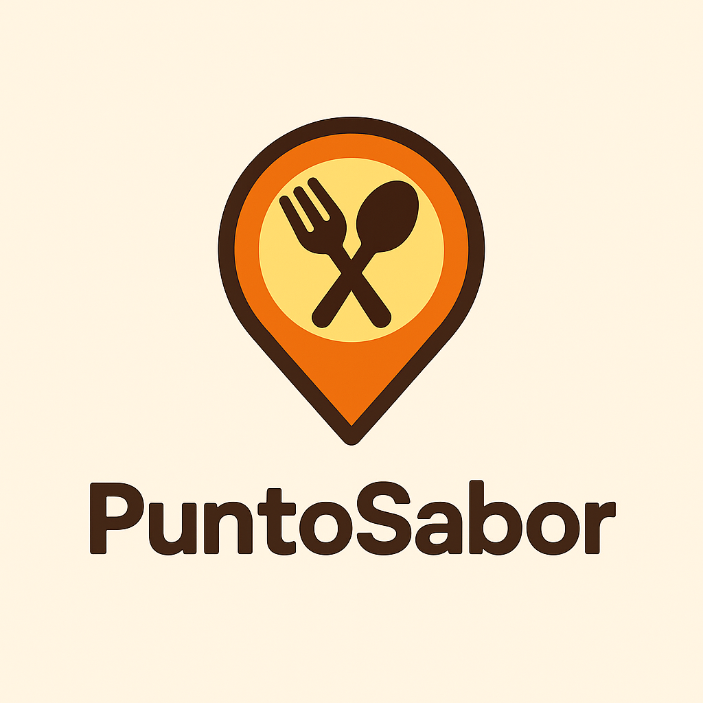

Typography:

Para la tipografía de PuntoSabor, se ha seleccionado una combinación que equilibra modernidad, legibilidad y calidez. La tipografía principal Poppins se utiliza en los encabezados, aportando un estilo fresco y amigable, ideal para captar la atención del usuario en títulos y mensajes clave. Para los textos de párrafo y componentes de interfaz, se emplea Inter, reconocida por su alta legibilidad en entornos digitales, favoreciendo una experiencia clara y ordenada.

Esta combinación tipográfica refuerza el carácter accesible y confiable de la marca, al mismo tiempo que permite destacar información importante y mantener un diseño coherente en toda la aplicación web.

A continuación, se detallan las tipografías adoptadas para PuntoSabor siguiendo los parámetros de color, peso, tamaño, interlineado y alineación:
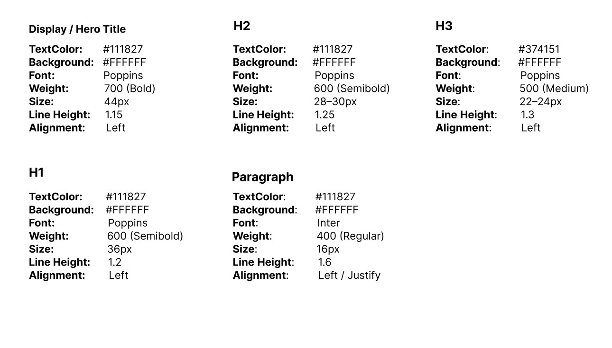

Colors:

La paleta de colores de PuntoSabor fue seleccionada para reflejar los valores de autenticidad, cercanía y dinamismo que definen a nuestra plataforma. Los tonos predominantes, rojo, verde y amarillo, evocan energía, sabor y frescura, transmitiendo la esencia de los huariques y la cultura gastronómica local.

La combinación de colores busca generar confianza en los usuarios, a la vez que mantiene un carácter amigable y moderno, reforzando la identidad visual del producto como una solución innovadora para descubrir pequeños negocios de comida.
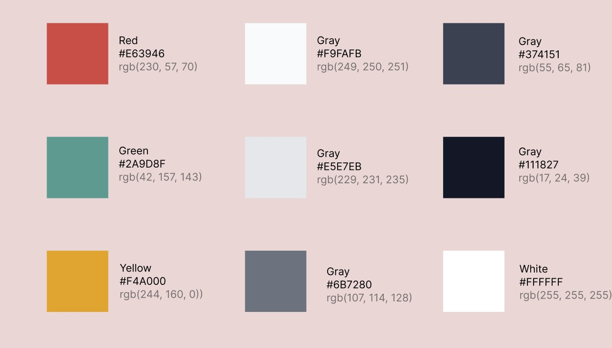

Spacing:

El espaciado en PuntoSabor está cuidadosamente definido para garantizar una interfaz limpia, legible y organizada. Se emplea una separación uniforme entre elementos, lo que mejora la jerarquía visual, facilita la navegación y aporta equilibrio al diseño.

El sistema de espaciado se basa en una escala modular de 8px, adaptada para mantener consistencia en todas las vistas de la aplicación.
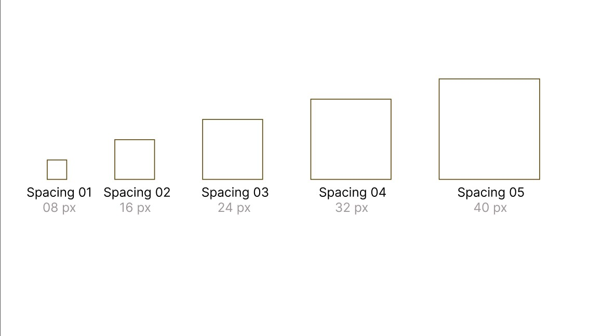
### 4.1.2. Web Style Guidelines
PuntoSabor cuenta con un diseño web adaptable y responsivo, que garantiza una experiencia fluida y accesible en cualquier dispositivo, desde computadoras de escritorio hasta teléfonos móviles.

El patrón de diseño principal sigue la forma de “F” y “Z”, ya que son los más efectivos para dirigir la atención del usuario en interfaces web modernas. Este enfoque permite destacar funciones clave como la barra de búsqueda, los listados de huariques y las promociones destacadas, asegurando que el contenido más relevante esté siempre visible en los primeros segundos de navegación.

En la estructura visual:

El logo de PuntoSabor se ubica en la esquina superior izquierda como ancla de marca.

La barra de navegación con secciones principales (Explorar, Mejor valorados, Promos, Contacto) se encuentra en la parte superior derecha, permitiendo un acceso rápido e intuitivo.

El llamado a la acción (CTA) principal —Buscar huariques o Registrarse— está resaltado con el color primario rojo , lo que atrae la mirada del usuario de inmediato.

El hero section incluye un buscador interactivo con filtros de comida y ubicación, optimizando la experiencia de exploración.

Secciones como “Cerca de ti” y “Mejor valorados” utilizan un sistema de tarjetas modulares que mantienen consistencia y escalabilidad.

Se incluyen chips y badges de colores para resaltar promociones, precios y distancias, mejorando la jerarquía visual.

El footer minimalista refuerza la identidad de marca y proporciona enlaces clave sin sobrecargar la interfaz.

La interfaz en su conjunto transmite autenticidad, simplicidad y dinamismo, reflejando los valores de la marca y favoreciendo la interacción constante entre exploradores gastronómicos y dueños de huariques.
## 4.2. Information Architecture
La arquitectura de la información en **PuntoSabor** se ha diseñado para garantizar que tanto visitantes como usuarios puedan encontrar con facilidad el contenido y las funciones más relevantes, minimizando la carga cognitiva y generando una experiencia intuitiva. Las decisiones adoptadas buscan reflejar autenticidad, cercanía y dinamismo, alineándose con la identidad de la marca y con los valores de los huariques como espacios gastronómicos locales.
### 4.2.1. Organization Systems
En **PuntoSabor** se aplican distintos sistemas de organización según el tipo de contenido y la plataforma:

- **Organización jerárquica (Visual Hierarchy):** en la landing page se estructura la información en niveles: primero se presenta la propuesta de valor y el buscador principal, seguido de secciones de beneficios, exploración de huariques mejor valorados, promociones y finalmente el contacto.  

- **Organización secuencial (Step-by-step):** en la aplicación web, procesos como el registro de huariques o la actualización de información siguen un flujo paso a paso que guía al usuario de manera clara.  

- **Organización por tópicos:** el catálogo de huariques se categoriza según criterios como tipo de comida (criolla, marina, postres, etc.), ubicación, y estado de promociones (activas, destacadas).  

- **Organización según audiencia:** la landing page presenta bloques diferenciados: exploradores gastronómicos (jóvenes y adultos que buscan comida auténtica) y dueños de huariques (emprendedores locales). Cada segmento recibe mensajes y beneficios específicos.  
### 4.2.2. Labeling Systems
El etiquetado en **PuntoSabor** prioriza la claridad y simplicidad, usando palabras cortas, directas y consistentes en todas las interfaces:

- **Landing Page:** Inicio, Explorar, Beneficios, Promos, Contacto.  
- **Aplicación Web:** Huariques, Favoritos, Reseñas, Promociones, Perfil.  

Además, los CTAs refuerzan la acción con verbos imperativos como **“Buscar Huariques”**, **“Registra tu negocio”**, **“Explora promociones”** o **“Deja tu reseña”**, que facilitan la interacción y mantienen coherencia con los objetivos de la plataforma.
### 4.2.3. SEO Tags and Meta Tags
Se han definido meta elementos para mejorar el posicionamiento SEO tanto en la landing page como en la aplicación web:

- **Title (Landing Page):** PuntoSabor | Descubre huariques auténticos cerca de ti.  
- **Meta Description:** PuntoSabor conecta a exploradores gastronómicos con huariques auténticos y económicos, ofreciendo reseñas confiables, mapas interactivos y promociones exclusivas.  
- **Meta Keywords:** huariques, comida peruana, gastronomía local, reseñas, recomendaciones, restaurantes pequeños, comida auténtica.  
- **Author:** Equipo FijasDev – Startup PuntoSabor.  

Estos elementos aseguran coherencia en motores de búsqueda y fortalecen la estrategia de atracción de usuarios.
### 4.2.4. Searching Systems
La aplicación web de **PuntoSabor** ofrece sistemas de búsqueda diseñados para que el usuario encuentre lo que necesita sin esfuerzo:

- **Búsqueda en catálogo:** localización de huariques por nombre, tipo de comida o distrito.  
- **Filtros avanzados:** por rango de precios, valoración de usuarios, ubicación geográfica y promociones activas.  
- **Mapa interactivo:** permite aplicar filtros visuales y seleccionar huariques desde su ubicación exacta.  
- **Búsqueda en reseñas:** posibilidad de filtrar comentarios por calificación (positivas/negativas) o por temas (precio, atención, sabor).  

De esta manera se evita que el usuario se sienta perdido entre la cantidad de opciones disponibles y se mejora la eficiencia en la exploración.
### 4.2.5. Navigation Systems
La navegación de **PuntoSabor** combina claridad, consistencia y adaptabilidad:

- **Landing Page (Desktop):** menú superior con navegación horizontal que permite acceder rápidamente a Inicio, Explorar, Beneficios, Promos y Contacto.  
- **Landing Page (Móvil):** menú tipo hamburguesa con navegación vertical, optimizado para pantallas pequeñas.  
- **Aplicación Web:** navegación lateral (sidebar) con accesos directos a Huariques, Favoritos, Promociones, Perfil y Configuración.  
- **CTAs estratégicos:** botones visibles en rojo primario (#E63946) para guiar al usuario a acciones críticas como **buscar huariques**, **registrar un negocio** o **activar una promoción**.  

En conjunto, estos sistemas garantizan que los usuarios puedan recorrer
la plataforma de forma intuitiva, cumpliendo sus metas sin obstáculos.
## 4.3. Landing Page UI Design
La interfaz de la landing page es clave para el proyecto, pues constituye la primera impresión del producto. Debe ofrecer una experiencia estética y funcional que atraiga de inmediato a los visitantes y los impulse a seguir explorando.

### 4.3.1. Landing Page Wireframe
**Landing Page para Desktop Web Browser**

**Landing Page para Mobile Web Browse**

### 4.3.2. Landing Page Mock-up
Esta sección presenta y explica los Mock-ups del Landing Page, tanto en su versión para Desktop Web Browser como Mobile Web Browser. En la propuesta y la 
explicación debe evidenciarse la aplicación de los principios, elementos de diseño, diseño inclusivo y arquitectura de información, así como el Design System establecido para los productos digitales.

## 4.4. Web Applications UX/UI Design
El diseño de experiencia de usuario (UX) y de interfaz de usuario (UI) en aplicaciones web consiste en construir una experiencia digital que resulte clara, práctica y agradable para las personas que la utilizan. La UX se enfoca en identificar las necesidades y expectativas de los usuarios, diseñando flujos de navegación y estructuras de información que hagan más sencilla la interacción. En cambio, la UI aborda la parte visual de la aplicación, como el estilo de los botones, menús y la organización del contenido en pantalla. Cuando ambos enfoques se integran de forma adecuada, se logra un equilibrio entre estética y usabilidad, generando así una experiencia atractiva, funcional y memorable para los usuarios.

### 4.4.1. Web Applications Wireframes
**Web applications wireframes desktop**

**Web applications wireframes mobile**

### 4.4.2. Web Applications Wireflow Diagrams
Los diagramas de wireflow para aplicaciones web son representaciones visuales que muestran tanto la navegación como la estructura de una aplicación. Estos combinan características de los wireframes y de los diagramas de flujo, ofreciendo una visión clara de cómo los usuarios se desplazan por la plataforma y de qué manera interactúan con sus diferentes funciones. Su utilidad radica en detectar posibles dificultades de usabilidad y en asegurar que la experiencia del usuario sea consistente y eficiente.
En el caso de PuntoSabor, el diagrama de wireflow ilustra los recorridos principales de sus dos tipos de usuarios: el descubridor gastronómico y el dueño de restaurante. Incluye procesos clave como la autenticación, la exploración de categorías de comida, la búsqueda de huariques cercanos, el acceso a promociones, la gestión de planes de membresía, así como funciones para editar el perfil y acceder al soporte.

### 4.4.2. Web Applications Mock-ups
**Web applications Mock-ups desktop**

**Web applications Mock-ups mobile**

### 4.4.3. Web Applications User Flow Diagrams
El User Flow Diagram es una representación gráfica del recorrido que sigue un usuario al interactuar con una aplicación o sitio web. En él se detalla la secuencia de acciones necesarias para cumplir una tarea concreta, lo que permite detectar posibles dificultades en el proceso y mejorar la experiencia del usuario.

Leyenda:

Flujo de usuario:
Empieza con el usuario ingresando la página de inicio de PuntoSabor. Aqui determina  si es "Explorador Gastronómico" o "Dueño de Restaurante"

Flujo de Explorador Gastronómico:El usuario con rol de Explorador Gastronómico puede acceder a un buscador para obtener información sobre huariques. En caso de no realizar una búsqueda, podrá visualizar sugerencias. 

Flujo de Dueño de Restaurante: El usuario con rol de Dueño de Restaurante puede acceder a su perfil, consultar y modificar su plan, así como gestionar la lista de huariques, productos y promociones. Además, tiene la opción de actualizar su perfil añadiendo o editando un huarique: cambiar el nombre, actualizar la foto, modificar la ubicación y gestionar los productos y promociones. También podrá programar una sesión de retroalimentación en una fecha determinada.

Vista general del flujo de usuario:

## 4.5. Web Applications Prototyping
Prototipo de la aplicación web PuntoSabor en figma:
**https://www.figma.com/design/lT88eEZFP7G86QwYXq59Lc/PuntoSabor?node-id=0-1&p=f&t=NTWZ6fdPzB6mKTpe-0**

## 4.6. Domain-Driven Software Architecture
La arquitectura de software orientada al dominio es una metodología de diseño que organiza la estructura del sistema a partir de los conceptos y procesos esenciales de un área específica. Este enfoque permite construir aplicaciones alineadas con las necesidades reales y la lógica del negocio, facilitando tanto la incorporación de funcionalidades concretas como la adaptación ante cambios en el entorno. En PuntoSabor, aplicamos esta arquitectura para estructurar la plataforma de manera clara y escalable, lo que garantiza el desarrollo de una aplicación robusta, flexible y sencilla de mantener.

 ### 4.6.1. Design-Level EventStorming.

### 4.6.2. Software Architecture Context Diagram
**Elementos:**
- **PuntoSabor:** Principal para los usuarios
- **Usurio - Descubridor gastronómico:** Encuentra huariques poco conocidos 
- **Usuario - Dueño de restaurante:** Publica su huarique y más cosas según su plan de membresía 

.png>)

### 4.6.3. Software Architecture Container Diagrams
**Elementos:**
- **Aplicación web:** Frontend donde los usuarios interactúan con la aplicación 
Se usará tecnología: Vue.js
- **Servidor de aplicaciones:** Backend que maneja los planes de membresía de los usuarios.
Se usará tecnología: C#
- **Base de datos:** Almacena los datos de los usuarios, sus planes y cosas que realizan en la aplicación.
Se usara tecnología: SQL  server 

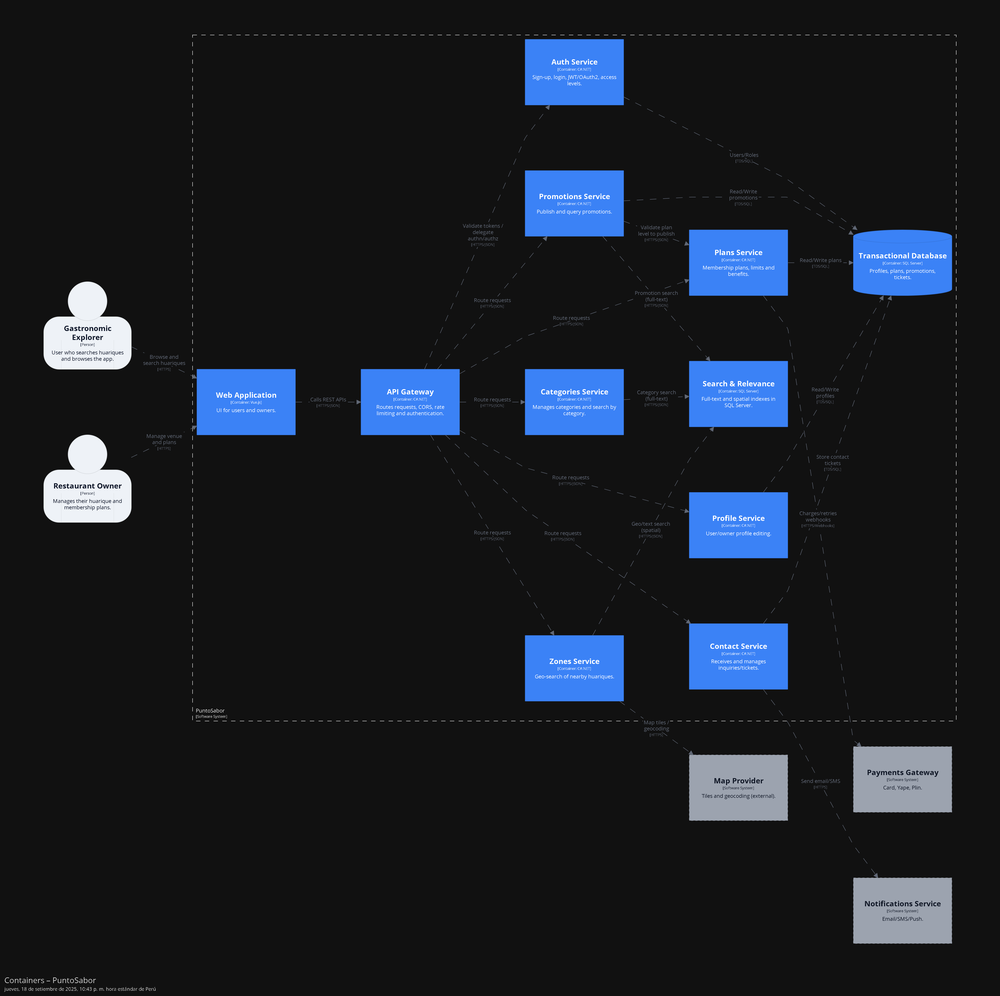

### 4.6.4. Software Architecture Components Diagrams

API Service — Components

.png>)

Categories Service — Components

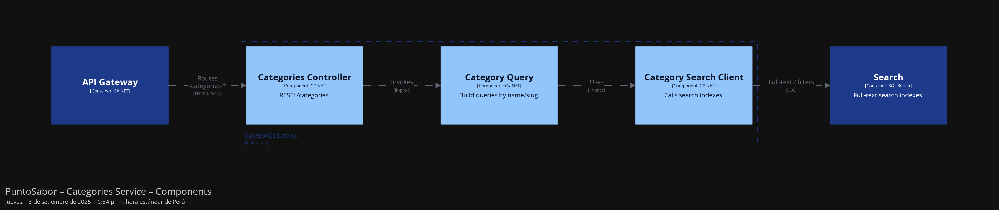

Zones Service — Components

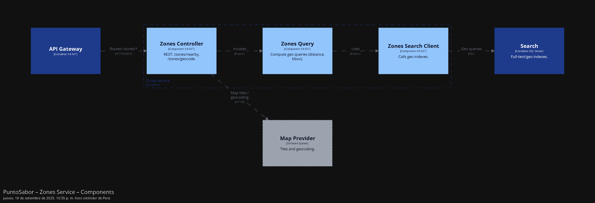

Promotions Service — Components

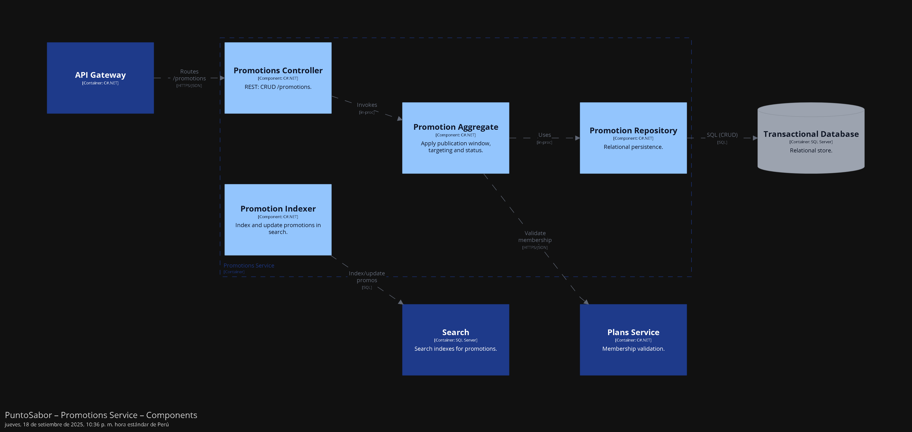

## 4.7. Software Object-Oriented Design
### 4.7.1. Class Diagrams
### 4.7.2. Class Dictionary
## 4.8. Database Design
### 4.8.1. Database Diagram

# Capítulo V: Product Implementation, Validation & Deployment
## 5.1. Software Configuration Management
### 5.1.1. Software Development Environment Configuration
### 5.1.2. Source Code Management
### 5.1.3. Source Code Style Guide & Conventions
### 5.1.4. Software Deployment Configuration
## 5.2. Landing Page, Services & Applications Implementation
### 5.2.1. Sprint 1
#### 5.2.1.1. Sprint Planning 1
#### 5.2.1.2. Aspect Leaders and Collaborators
#### 5.2.1.3. Sprint Backlog 1
#### 5.2.1.4. Development Evidence for Sprint Review
#### 5.2.1.5. Execution Evidence for Sprint Review
#### 5.2.1.6. Services Documentation Evidence for Sprint Review
#### 5.2.1.7. Software Deployment Evidence for Sprint Review
#### 5.2.1.8. Team Collaboration Insights during Sprint  

# Conclusiones

# Bibliografía

# Anexos